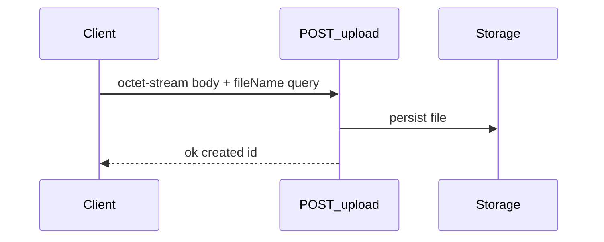
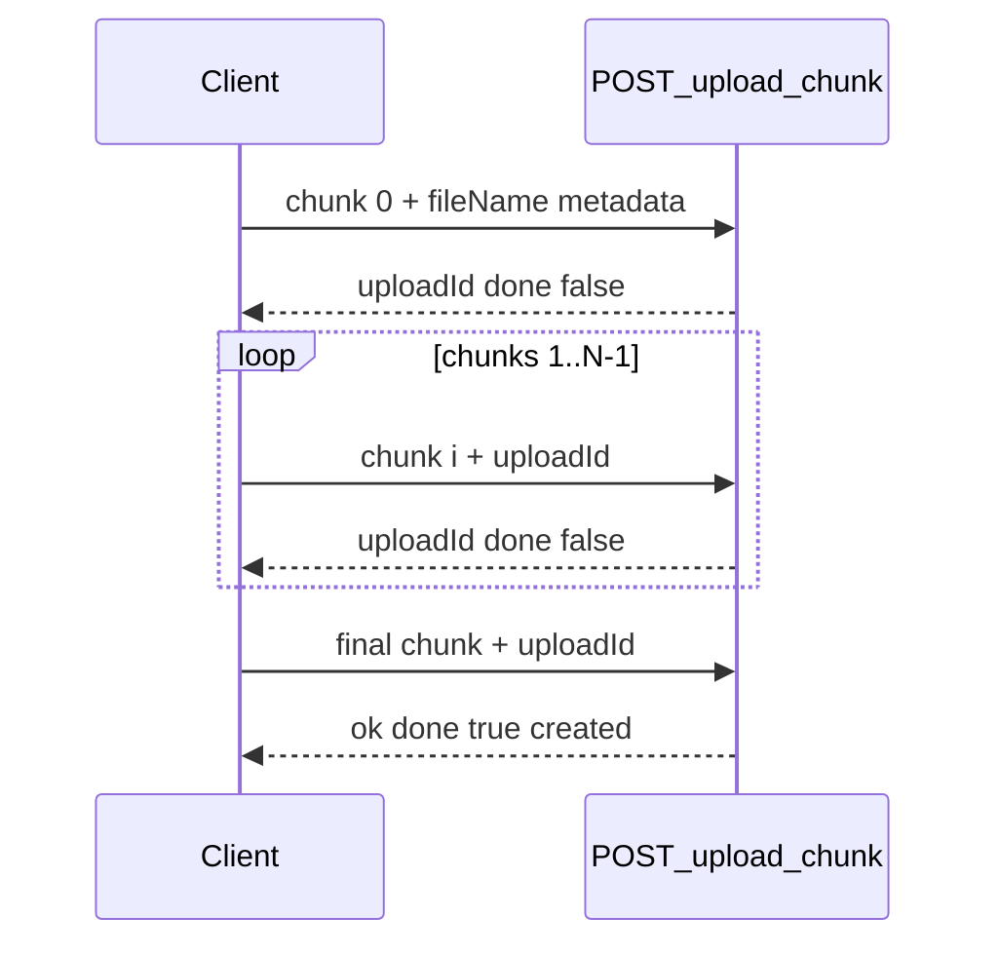

# Workflows

End-to-end recipes for common integrations. All steps below work with a **developer API key** unless noted.

Set shell variables for copy-paste:

```bash
export ORIGIN='http://localhost:1025'
export API_KEY='znldv_…'
```

---

## Personal drive automation {#personal-drive}

List root → create folder → upload → update metadata → download.

```bash
# 1. List root
curl "$ORIGIN/api/drive/files?storageProvider=local" \
  -H "Authorization: Bearer $API_KEY"

# 2. Create folder
curl -X POST "$ORIGIN/api/drive/folders" \
  -H "Authorization: Bearer $API_KEY" \
  -H 'Content-Type: application/json' \
  -d '{"name":"Backups","storageProvider":"local"}'
# → note "id" as PARENT_ID

# 3. Upload small file (≤ 8 MiB)
curl -X POST "$ORIGIN/api/drive/upload?fileName=backup.zip&storageProvider=local&parentId=$PARENT_ID" \
  -H "Authorization: Bearer $API_KEY" \
  -H 'Content-Type: application/octet-stream' \
  --data-binary @backup.zip
# → note "id" as FILE_ID

# 4. Star the file
curl -X PATCH "$ORIGIN/api/drive/files/$FILE_ID" \
  -H "Authorization: Bearer $API_KEY" \
  -H 'Content-Type: application/json' \
  -d '{"isStarred":true}'

# 5. Download
curl -o out.zip "$ORIGIN/api/drive/files/$FILE_ID/download" \
  -H "Authorization: Bearer $API_KEY"
```

---

## Simple upload {#simple-upload}



Use `POST /api/drive/upload` when file size ≤ **8 MiB**. See [Drive API](./drive-api#post-apidriveupload).

---

## Chunked upload {#chunked-upload}

For files larger than 8 MiB, send **8 MiB** chunks to `POST /api/drive/upload/chunk`.



**Pseudocode**

1. Split file into `chunkCount = ceil(fileSize / 8388608)` chunks.
2. **Chunk 0:** query includes `chunkIndex=0`, `chunkCount`, `fileName`, `storageProvider`, optional `parentId`/`teamId`. Body = first 8 MiB.
3. Save `uploadId` from response.
4. **Chunks 1…N−1:** query includes `chunkIndex`, `chunkCount`, `uploadId`. Body = chunk bytes.
5. On last response with `"done": true`, read `created[0].id`.

---

## Team drive {#team-drive}

```bash
# Create team
curl -X POST "$ORIGIN/api/teams" \
  -H "Authorization: Bearer $API_KEY" \
  -H 'Content-Type: application/json' \
  -d '{"name":"Ops","storageProvider":"local"}'
# → TEAM_ID

# List team root
curl "$ORIGIN/api/drive/files?teamId=$TEAM_ID&storageProvider=local" \
  -H "Authorization: Bearer $API_KEY"

# Upload to team
curl -X POST "$ORIGIN/api/drive/upload?fileName=runbook.md&teamId=$TEAM_ID&storageProvider=local" \
  -H "Authorization: Bearer $API_KEY" \
  -H 'Content-Type: application/octet-stream' \
  --data-binary @runbook.md

# Team views
curl "$ORIGIN/api/drive/trash?teamId=$TEAM_ID" -H "Authorization: Bearer $API_KEY"
curl "$ORIGIN/api/drive/recent?teamId=$TEAM_ID" -H "Authorization: Bearer $API_KEY"
curl "$ORIGIN/api/drive/stats?teamId=$TEAM_ID" -H "Authorization: Bearer $API_KEY"
```

Invite members with `POST /api/teams/$TEAM_ID/invites` — see [Teams API](./teams-api).

---

## Sharing with another user {#sharing}

Owner shares by email; recipient lists inbound shared content.

```bash
# Owner: share folder
curl -X POST "$ORIGIN/api/drive/files/$FOLDER_ID/share" \
  -H "Authorization: Bearer $API_KEY" \
  -H 'Content-Type: application/json' \
  -d '{"targetEmail":"recipient@example.com","permission":"read"}'

# Recipient (their API key): list shared with me
curl "$ORIGIN/api/drive/shared?storageProvider=local" \
  -H "Authorization: Bearer $RECIPIENT_API_KEY"
```

Team **outbound** shares: `GET /api/drive/shared?teamId=<TEAM_UUID>`.

---

## Public links {#public-links}

```bash
# Create public link (owner)
curl -X POST "$ORIGIN/api/drive/files/$FILE_ID/public-link" \
  -H "Authorization: Bearer $API_KEY"
# → shareUrl, fileDirectUrl, token

# Anyone: metadata (no auth)
curl "$ORIGIN/api/public/share/$TOKEN"

# Anyone: download (no auth)
curl -o file.bin "$ORIGIN/api/public/files/$TOKEN"

# Revoke
curl -X DELETE "$ORIGIN/api/drive/files/$FILE_ID/public-link" \
  -H "Authorization: Bearer $API_KEY"
```

---

## Trash lifecycle {#trash}

Retention period is returned by `GET /api/drive/trash` as `trashRetentionDays`.

```bash
# Move to trash
curl -X PATCH "$ORIGIN/api/drive/files/$FILE_ID" \
  -H "Authorization: Bearer $API_KEY" \
  -H 'Content-Type: application/json' \
  -d '{"trashed":true}'

# List trash
curl "$ORIGIN/api/drive/trash?storageProvider=local" \
  -H "Authorization: Bearer $API_KEY"

# Restore
curl -X PATCH "$ORIGIN/api/drive/files/$FILE_ID" \
  -H "Authorization: Bearer $API_KEY" \
  -H 'Content-Type: application/json' \
  -d '{"trashed":false}'

# Permanent delete (must be in trash first)
curl -X DELETE "$ORIGIN/api/drive/files/$FILE_ID" \
  -H "Authorization: Bearer $API_KEY"
```

Expired items are purged by `POST /api/cron/purge-trash` (ops only).

---

## Reorder folder contents

```bash
curl -X POST "$ORIGIN/api/drive/files/reorder" \
  -H "Authorization: Bearer $API_KEY" \
  -H 'Content-Type: application/json' \
  -d '{"orderedIds":["id-a","id-b","id-c"],"parentId":"parent-uuid","storageProvider":"local"}'
```

---

## Related

- [Getting started](./getting-started)
- [Drive API](./drive-api)
- [Teams API](./teams-api)
- [Errors](./errors)
